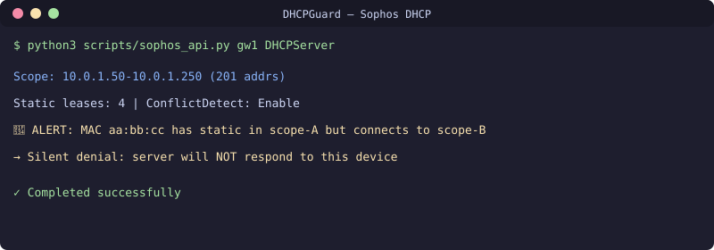

# Инструментарий Sophos DHCP

Python-инструментарий для управления DHCP и его диагностики на Sophos Firewall через XML API. Включает обнаружение scope'ов, анализ аренд, детектирование конфликтов и критически важный паттерн «статическая аренда в чужом scope», который вызывает молчаливые сбои DHCP.

## Ключевая находка: молчаливый отказ DHCP

Sophos с включённым `ConflictDetection=Enable` **молча игнорирует** DHCP DISCOVER от устройства, у которого есть статическая аренда в конфигурации ДРУГОГО scope. Никакого NAK, никакой ошибки — просто тишина. Устройство циклится часами.

**Детектирование**: сравнивайте статические аренды во ВСЕХ scope'ах. Если у MAC есть статическая резервация в scope-A, но DISCOVER приходит на интерфейс scope-B — сервер не ответит.

## Скрипты

| Скрипт | Назначение |
|--------|------------|
| `scripts/sophos_api.py` | Универсальная обёртка XML API (Get/Set/Filter) |
| `scripts/dhcp_scope_audit.py` | Дамп всех scope'ов: пулы, статики, утилизация |
| `scripts/lease_analyzer.py` | Разбор syslog на события аренды, поиск аномалий |

## Подводные камни API (из реального внедрения)

- Валидные модули Get: `DHCP`, `DHCPServer`, `Interface`, `IPHost`, `FirewallRule`, `DHCPRelay`
- **НЕ валидны** (ошибка 529): `Syslog`, `LogSettings`, `SystemSettings`, `VPNSSL`, `Route` — не повторяйте запросы к ним
- `DHCPServer` возвращает ВСЕ scope'ы с пулами, статиками, DNS, шлюзом и временем аренды
- `Interface` возвращает все IP шлюзов VLAN — используйте для сопоставления scope ↔ VLAN
- REST API v2 (`/console/api/v2/`) может быть отключён даже на свежих версиях SFOS

## Лицензия
MIT

## 📬 Контакты

Вопросы? Пишите: **[allumaxmail@gmail.com](mailto:allumaxmail@gmail.com)**

---

